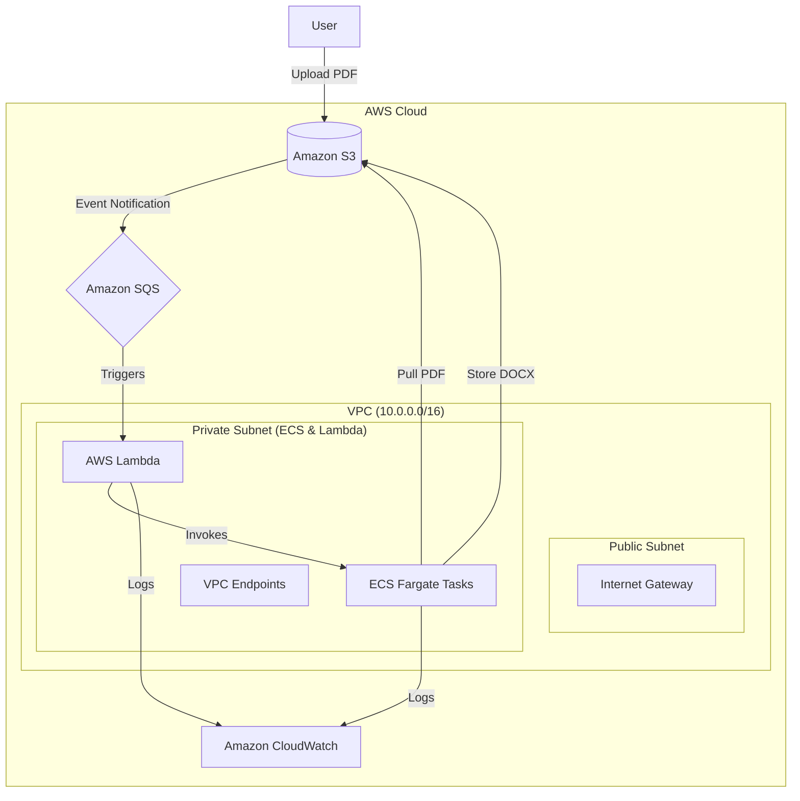

# Serverless PDF to DOCX Converter using AWS ECS Fargate


A cloud-native solution for converting PDF files to DOCX format using serverless AWS services and ECS Fargate.

## Project Overview

This project demonstrates a scalable PDF conversion pipeline using:
- **Amazon S3** for file storage
- **Amazon SQS** for message queuing
- **AWS Lambda** for event-driven triggers
- **ECS Fargate** for containerized processing
- **VPC** with isolated networking

## Key Features

- 🚀 **Fully Serverless Architecture**
- 🔄 **Event-driven processing** via S3 triggers
- 📦 **Containerized conversion logic** in ECS Fargate
- ⚡ **Auto-scaling infrastructure**
- 🔒 **Secure VPC configuration** with private subnets
- 📊 **CloudWatch monitoring** for logs and metrics

## Architecture


## Workflow

1. User uploads PDF to S3 bucket
2. S3 event notification sends message to SQS queue
3. Lambda function triggered by SQS messages
4. ECS Fargate task processes PDF conversion
5. Converted DOCX file stored back in S3
6. All logs streamed to CloudWatch

## Prerequisites

- AWS Account with appropriate permissions
- AWS CLI v2 installed and configured
- Terraform (for infrastructure deployment)
- Docker (for container image creation)

## Deployment Steps

1. Clone repository:
   ```bash
   git clone https://github.com/your-repo/pdf-to-docx-converter.git
   cd pdf-to-docx-converter
2. **Build Docker image**:
   ```bash
   docker build -t pdf-converter .
3. **Terraform initialization**:
   ```bash
   cd infrastructure
   terraform init
4. **Deploy infrastructure**:
   ```bash
   terraform apply -auto-approve
5. **Upload test PDF** to the created S3 bucket

## Configuration

| Component       | Environment Variables           |
|-----------------|----------------------------------|
| ECS Task        | `S3_BUCKET`, `QUEUE_URL`         |
| Lambda Function | `ECS_CLUSTER`, `TASK_DEFINITION` |

## Monitoring

All services send logs to CloudWatch:
- Conversion metrics under `/aws/ecs/pdf-conversion`
- Lambda invocation logs at `/aws/lambda/pdf-trigger`
- S3 access logs in `s3-access-logs`

## Cleanup

To remove all resources:
```bash
terraform destroy -auto-approve
