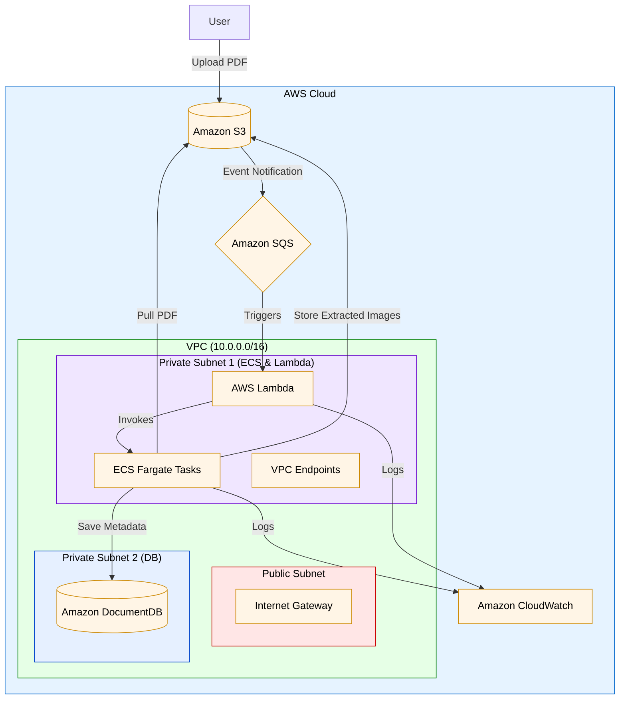

# AWS GPU-Powered PDF Processing System

[](https://opensource.org/licenses/MIT)

A scalable solution for processing PDF research papers using AWS Fargate GPU tasks, S3, SQS, and DocumentDB.

**Note:** This README will evolve as we implement different components of the system.

## Table of Contents
- [Architecture Overview](#architecture-overview)
- [Current Features](#current-features)
- [Prerequisites](#prerequisites)
- [Deployment](#deployment)
- [Configuration](#configuration)
- [Cost Optimization](#cost-optimization)
- [Troubleshooting](#troubleshooting)
- [Roadmap](#roadmap)
- [Contributing](#contributing)
- [License](#license)

## Architecture Overview


Components:
- **S3 Bucket**: PDF storage with event notifications
- **SQS FIFO Queue**: Message broker for processing tasks
- **Fargate GPU Tasks**: OCR and layout parsing using LayoutParser/PaddleOCR
- **DocumentDB**: Structured storage of extracted content
- **VPC with Private Subnets**: Secure networking without NAT Gateway

## Current Features
✅ **Implemented**  
- Terraform infrastructure as code
- VPC configuration with cost-optimized networking
- S3 + SQS integration
- GPU-optimized ECS cluster setup
- DocumentDB cluster configuration

🛠 **In Progress**  
- OCR processing container implementation
- Auto-scaling policies
- Monitoring integration

## Prerequisites
- AWS Account with appropriate permissions
- Terraform v1.5.0+
- AWS CLI configured
- Docker (for container development)
- GPU-enabled Docker runtime (for local testing)

## Deployment

### Initial Setup
```bash
# Clone repository
git clone https://github.com/hyperverseglobalconsulting/pdf_data_extraction_statless_comps.git
cd pdf_data_extraction_statless_comps

# Initialize Terraform
terraform init

# Review execution plan
terraform plan -out=tfplan
```
## Infrastructure Provisioning
```bash
# Apply configuration
terraform apply tfplan

# Outputs will show:
# - S3 bucket name
# - DocumentDB endpoint
# - SQS queue URL
```
## Destroying Resources
```bash
terraform destroy
```
## Configuration

### Environment Variables
| Variable               | Description                     | Required |
|------------------------|---------------------------------|----------|
| `AWS_PROFILE`          | CLI credential profile          | Yes      |
| `TF_VAR_docdb_password`| DocumentDB admin password       | Yes      |

### Service Configuration
Update `variables.tf` for:
- AWS region
- Cluster sizing
- Auto-scaling thresholds
- GPU requirements

## Cost Optimization
- **VPC Design**: Uses interface endpoints instead of NAT Gateway  
- **Fargate Spot**: Add spot pricing configuration  
- **DocumentDB**: T3 instances for dev/test environments  
- **S3 Lifecycle**: Add rules for PDF versioning  

## Troubleshooting
**Common Issues:**  
- 🛠 **GPU Driver Errors**: Ensure NVIDIA container toolkit is installed  
- 📨 **S3 Event Delivery**: Check SQS access policy and bucket notification  
- ⏱ **VPC Endpoint Timeouts**: Validate security group rules  
- 🔌 **DocumentDB Connectivity**: Verify subnet group associations  

## Roadmap
### Phase 1: Core Infrastructure (Current)
- [x] Terraform base configuration  
- [ ] Monitoring integration  
- [ ] CI/CD pipeline setup  

### Phase 2: Processing Implementation
- [ ] OCR container development  
- [ ] Performance benchmarking  
- [ ] Load testing  

### Phase 3: Optimization
- [ ] Cold start mitigation  
- [ ] Multi-model inference  
- [ ] Cost alerts  

## Contributing
1. Fork the repository  
2. Create feature branch: `git checkout -b feature/improvement`  
3. Commit changes  
4. Push to branch  
5. Open PR  

## License  
MIT License - see [LICENSE](LICENSE) for details
